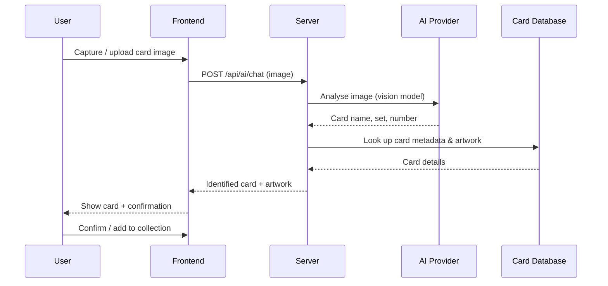

# Introduction

Welcome to **PokéDex Scanner** — an AI-powered web application for scanning, identifying, and managing your Pokémon TCG card collection.

## What is PokéDex Scanner?

PokéDex Scanner lets you:

- 📷 **Scan cards** using your device camera or by uploading an image
- 🤖 **AI recognition** — the app automatically identifies the card (name, set, rarity) without any manual input
- 🗃️ **Manage your collection** — organise cards into named collections, track duplicates, and see estimated values
- 🔍 **Search & filter** — find any card in your collection instantly
- 💾 **Import / export** — share or back up your collection as JSON

## How does it work?

## Key Concepts

### AI Providers

The app uses a **vision-capable language model** to read the card from the image. You can choose your preferred provider — GitHub Models is the default and requires only a free GitHub Personal Access Token. See [AI Providers](../configuration/ai-providers.md) for details.

### Offline Card Database

Card artwork and metadata come from a **local SQLite database** downloaded from the Pokémon TCG Data GitHub release. This means:

- No per-lookup API calls after the initial download
- Card lookups are instant (<100 ms)
- Everything works on a local network without internet access (after the database is downloaded)

### Collections

You can organise your cards into any number of named **collections** (e.g., "Favourites", "For Trade", "Scarlet & Violet"). Each card can appear in multiple collections.

## Next Steps

- [Quick Start](quick-start.md) — be up and running in a few minutes
- [Installation](installation.md) — detailed setup instructions
- [Requirements](requirements.md) — hardware and software prerequisites
