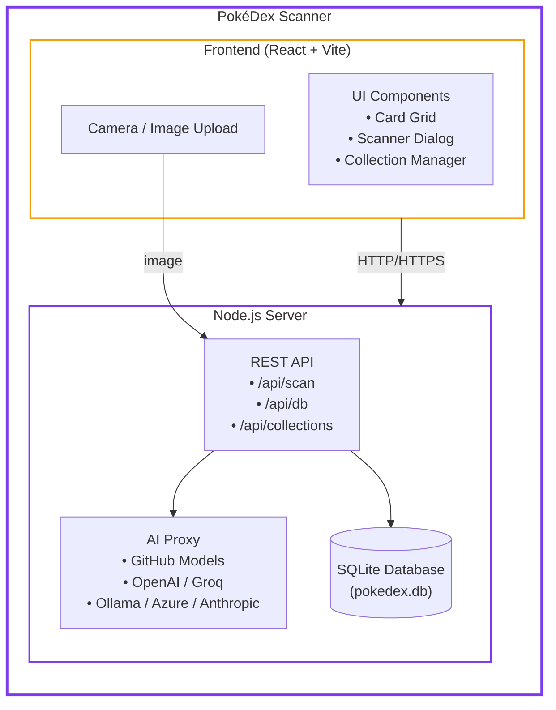

# PokéDex Scanner

[](https://github.com/pacorreia/pokemon-card-scanner/actions/workflows/ci.yml)
[](https://github.com/pacorreia/pokemon-card-scanner/blob/main/LICENSE)
[](https://nodejs.org/)

An AI-powered web application for scanning and managing your Pokémon TCG card collection, with multi-provider AI image recognition, an offline card database, and full collection management.

## Features

📷 **AI Card Recognition**

- Scan cards with your camera or by uploading an image — AI identifies the card automatically
- Supports multiple AI providers: GitHub Models, OpenAI, Groq, Ollama, Azure OpenAI, and Anthropic Claude
- Manual entry fallback for cards you prefer to add without scanning

📦 **Collection Management**

- Organise cards into named custom collections
- Duplicate tracking with quantity counts
- Estimated collection value (EUR pricing)
- Import / export your collection as JSON

🔍 **Search & Filter**

- Search by card name, set, type, and rarity
- Real-time filtering across the full card database

🗄️ **Offline Database**

- Downloads the full Pokémon TCG card database locally for accurate lookups and artwork
- SQLite-backed server storage — survives restarts and Docker container reuse

🔐 **Optional API Protection**

- Shared-secret session cookie auth for mutating endpoints (`API_SECRET`)
- HTTPS support with auto-generated self-signed certificate

## Quick Links

- **[Getting Started](getting-started/index.md)** — New here? Start with the introduction
- **[Quick Start](getting-started/quick-start.md)** — Be up and running in minutes
- **[Installation](getting-started/installation.md)** — Detailed setup guide
- **[AI Providers](configuration/ai-providers.md)** — Switch between AI backends
- **[Docker Deployment](guides/docker.md)** — Run with Docker or Docker Compose

## Architecture Overview



## Getting Started

=== "Local Development"

    ```bash
    git clone https://github.com/pacorreia/pokemon-card-scanner.git
    cd pokemon-card-scanner
    npm install
    export GITHUB_MODELS_TOKEN="<your_github_pat>"
    npm run dev:full
    ```

    Open <http://localhost:5173> in your browser.

=== "Docker"

    ```bash
    docker run -d \
      --name pokedex-scanner \
      -e GITHUB_MODELS_TOKEN="<your_github_pat>" \
      -v pokedex-data:/data \
      -p 8787:8787 \
      ghcr.io/pacorreia/pokemon-card-scanner:latest
    ```

    Open <http://localhost:8787> in your browser.

## Download the Card Database

On first launch the app will prompt you to download the Pokémon TCG database (card artwork, set info, and pricing). Click **Download** and wait for it to complete — typically only needed once per data directory.

## Support

- 🐛 [Report Issues](https://github.com/pacorreia/pokemon-card-scanner/issues)
- 💡 [Request Features](https://github.com/pacorreia/pokemon-card-scanner/issues)
- ⭐ Star the repo if you find it useful!

## License

MIT — Copyright GitHub, Inc.
